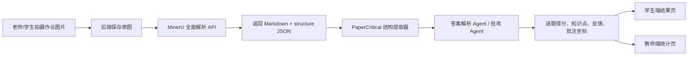

# PaperCritical MinerU + AI Agent 批改链路说明

## 1. 手写体识别用的是什么

当前项目的作业批改主链路使用 **MinerU 全能解析 API** 作为图片解析入口。老师或学生拍摄作业图片后，后端先把图片上传到 MinerU，全能解析返回 Markdown 和结构化结果，再由 PaperCritical 自研的批改 Agent 做答案抽取、逐题比对、评分、反馈和统计。

SimpleTex OCR 目前仍保留在项目中，主要用于花名册等辅助 OCR 场景，不作为作文/练习册批改主链路。

## 2. 核心流程



## 3. 作文批改链路

1. 老师或学生上传作文图片。
2. 后端调用 MinerU 全能解析。
3. 保存 MinerU 原始 Markdown 到 `tb_essay.mineru_markdown`。
4. 保存 MinerU 原始结构 JSON 到 `tb_essay.mineru_structure_json`。
5. 从 Markdown 和结构 JSON 中提炼适合 AI 分析的结构摘要，写入兼容字段 `ocr_text`。
6. 作文批改 Agent 根据题目、范文、评分标准和 MinerU 解析结果输出分数、维度评价、知识点、错误说明。
7. 系统保存 AI 结果，并在可能时生成红框/标记批注图。

## 4. 练习册批改链路

练习册不是简单把图片丢给大模型，而是拆成两个 Agent 阶段：

### 4.1 答案页解析 Agent

1. 老师创建练习册作业，填写科目、班级、题号范围、总分。
2. 老师上传答案页图片。
3. 后端把答案页逐页上传到 MinerU 全能解析。
4. 保存答案页 Markdown 到 `tb_assignment.answer_key_mineru_markdown`。
5. 保存答案页结构 JSON 到 `tb_assignment.answer_key_mineru_structure_json`。
6. 答案解析 Agent 从 MinerU 结构中抽取题号、标准答案、解析、知识点、每题分值，生成 `answer_key_json`。

### 4.2 学生作业批改 Agent

1. 学生端收到对应班级作业，上传多页练习册图片。
2. 后端逐页调用 MinerU 全能解析。
3. 多页解析结果合并为“按页组织”的 Markdown 和 structure JSON。
4. 批改 Agent 读取学生结构化作答与老师答案 JSON。
5. 输出逐题结果：学生答案、标准答案、得分、知识点、反馈、置信度、是否需要老师复核。
6. 教师端和学生端同步看到批改进度；已批改后进入统计。

## 5. 为什么不是完全依赖第三方大模型

PaperCritical 的价值不只是调用模型接口，而是构建了一个面向教学场景的 Agent 工作流：

- MinerU 负责文档结构解析，提供页面、文本块、公式、表格等结构信息。
- PaperCritical 自研结构提取器负责把原始结构压缩成适合批改的分析输入。
- 答案解析 Agent 负责把老师拍摄的答案页转换为可计算的标准答案。
- 批改 Agent 负责逐题评分、知识点归因、反馈生成和置信度判断。
- 统计 Agent/统计模块负责班级提交情况、平均分、薄弱知识点和学生明细汇总。
- 图片批注模块根据 Agent 输出的 annotations 在原图上叠加红框、编号和批注说明。

也就是说，大模型只是推理能力的一环，项目自己的数据结构、状态流转、批改规则、统计体系、图片批注和教学闭环才是核心产品能力。

## 6. 数据落库字段

新增或使用的关键字段：

- `tb_essay.ocr_text`：兼容旧页面的可读解析文本，现在保存 MinerU 结构摘要。
- `tb_essay.mineru_markdown`：学生提交图片的 MinerU Markdown 原始结果。
- `tb_essay.mineru_structure_json`：学生提交图片的 MinerU structure 原始结果。
- `tb_assignment.answer_key_json`：答案解析 Agent 生成的结构化标准答案。
- `tb_assignment.answer_key_mineru_markdown`：答案页 MinerU Markdown 原始结果。
- `tb_assignment.answer_key_mineru_structure_json`：答案页 MinerU structure 原始结果。
- `tb_essay.workbook_result_json`：练习册逐题批改结果。

## 7. 配置说明

MinerU Token 不应写入代码。后端通过环境变量注入：

```bash
MINERU_API_KEY=你的MinerU Token
MINERU_BASE_URL=https://mineru.net/api/v4
MINERU_MODEL_VERSION=vlm
```

本地或服务器数据库已有旧表时，需要执行对应迁移脚本：

- MySQL：`backend/src/main/resources/db/alter_mineru_structure_support.sql`
- PostgreSQL：`backend/src/main/resources/db/alter_mineru_structure_support_pg.sql`

## 8. 比赛答辩表述建议

可以这样讲：

> 我们不是简单接一个大模型做拍照批改，而是构建了“文档解析 Agent + 答案解析 Agent + 批改 Agent + 统计分析”的教学闭环。学生上传的手写作业先通过 MinerU 全能解析生成结构化文档，再由我们的批改 Agent 结合老师答案页、题号范围、知识点和评分规则进行逐题推理，最终同步到学生端反馈和教师端班级统计。
