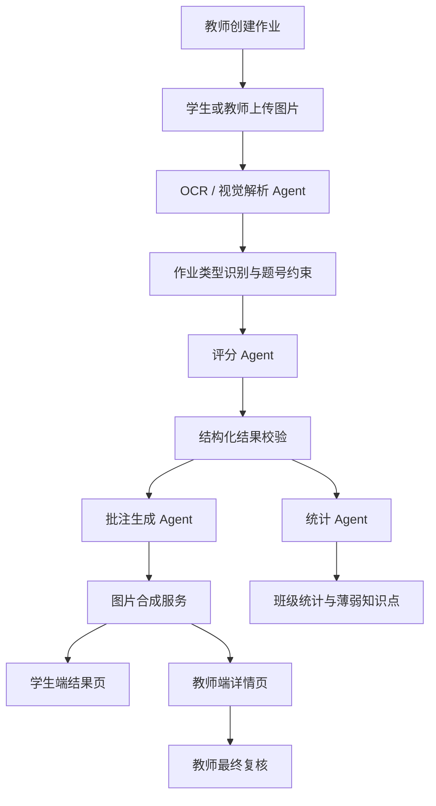

# PaperCritical 项目总览与演示文档

更新时间：2026-06-06

## 1. 项目定位

PaperCritical 是一个面向中小学日常作业批改场景的 AI 智能批改平台。项目围绕“教师布置作业、学生自主提交、AI 自动批改、教师复核统计、学生查看反馈”的教学闭环展开，重点解决教师重复性批改压力大、学生反馈滞后、班级薄弱知识点难统计的问题。

当前版本以 Android 基座 App、Spring Boot 后端、数据库、后台检测页为主要演示形态，已经支持作文作业、练习册作业、学生端提交、教师端代提交、AI 批改进度轮询、结果展示、真实图片批注、班级统计和用户反馈。

## 2. 一句话介绍

PaperCritical 不是一个简单调用大模型的批改工具，而是一个由自研业务流程、作业状态机、OCR 解析、评分规则、AI Agent 批改链路、图片批注生成、班级统计和教师复核共同组成的智能作业批改系统。

## 3. 用户角色

| 角色 | 使用场景 | 核心能力 |
| --- | --- | --- |
| 教师 | 创建作业、管理学生、查看结果、复核成绩 | 创建作文/练习册作业，上传答案页，查看学生提交状态，代未提交学生上传，查看统计与导出 |
| 学生 | 接收作业、上传作业、查看批改结果 | 使用账号登录，查看所属班级作业，提交单页或多页图片，查看批改中状态、分数、逐题反馈和批注图 |
| 管理员 | 演示检测、服务配置、数据概览 | 查看 Android 连接状态、AI/OCR 配置、上传目录、教师与批改记录 |

## 4. 核心功能

### 4.1 教师端

- 教师账号登录。
- 创建作文作业或练习册作业。
- 按班级发布作业，学生登录后自动看到对应作业。
- 管理学生名单和班级。
- 查看每个学生的提交状态：未提交、正在批改、已批改、失败、教师已复核。
- 对未提交学生进行教师代上传。
- 查看单个学生批改详情、AI 分、最终分、维度反馈、逐题反馈。
- 对 AI 结果进行最终分确认。
- 查看作业统计，包括提交人数、未交人数、批改中人数、平均分、薄弱知识点和学生得分表。
- 导出成绩统计。

### 4.2 学生端

- 学生使用分配好的账号登录，不需要手动输入班级。
- 学生只能看到自己所在班级的作业。
- 作文作业支持拍照或选择图片提交。
- 练习册作业支持多页图片提交。
- 批改过程中显示统一的“正在批改”状态和加载提示。
- 批改完成后展示总分、评价、知识点、逐题结果和批注图。
- 结果页优先展示后端生成的真实批注图片，避免前端叠层在手机端看不清。

### 4.3 练习册作业

- 作业类型扩展为 `ESSAY` 和 `WORKBOOK`。
- 教师创建练习册作业时填写科目、题号范围、总分等信息。
- 教师上传答案页，系统解析出结构化答案。
- 学生上传多页练习册作业图。
- AI 根据答案页、题号范围和学生作答进行逐题评分。
- 结果包含题号、学生答案、标准答案、得分、知识点、反馈和批注。
- 统计页展示班级整体完成情况和薄弱知识点。

### 4.4 原图批注

当前版本已经支持后端生成真实批注成品图：

- 后端保存 `annotatedImageUrl` 和 `annotatedImageUrls`。
- AI 返回坐标时，系统在原图对应位置绘制红框、编号和提示。
- AI 未返回精确坐标时，系统使用编号点和底部批注说明兜底。
- 学生端结果页优先展示批注成品图。
- 教师端预览优先展示批注成品图，同时保留原有可编辑叠层。
- 服务器已补充中文字体，避免图片中的中文批注显示异常。

## 5. AI Agent 批改链路

PaperCritical 的 AI 能力采用 Agent 化流程组织，而不是把图片直接丢给外部模型后展示原始结果。



### Agent 分工

| Agent / 模块 | 作用 |
| --- | --- |
| OCR / 视觉解析 Agent | 从作文图片、练习册图片、答案页中提取文字和结构信息 |
| 作业理解 Agent | 根据作业类型、题号范围、科目和答案页约束批改任务 |
| 评分 Agent | 对作文维度或练习册逐题进行评分，输出结构化 JSON |
| 批注生成 Agent | 将错误、知识点和反馈转成可落图的批注信息 |
| 统计 Agent | 汇总班级提交状态、平均分、薄弱知识点和学生得分表 |
| MVP Agent 流程 | 以最短链路保障课堂演示可用，优先保证上传、批改、展示、统计闭环稳定 |

## 6. 技术架构

| 层级 | 技术 | 说明 |
| --- | --- | --- |
| Android / 移动端 | uni-app、Vue | 通过 HBuilderX 运行到 Android 基座，提供教师端和学生端体验 |
| 后台网页 | Vite / Vue | 用于后台检测、配置检查、数据概览 |
| 后端 | Spring Boot 2.7、Java 11、MyBatis Plus | 提供认证、作业、学生、批改、统计、文件访问等 API |
| 数据库 | 本地 MySQL / 服务器 PostgreSQL | 本地演示可用 MySQL，服务器当前使用 PostgreSQL |
| 文件存储 | 本地上传目录 | 保存学生作业图、答案页、批注成品图 |
| AI/OCR | 可插拔服务配置 | 当前接入 OCR、MiMo / MinerU 等能力，但业务闭环和结果组织由项目后端控制 |

## 7. 主要目录

```text
PaperCritical/
|-- backend/                 Spring Boot 后端
|-- frontend/                uni-app Android/移动端
|-- admin-frontend/          后台网页
|-- .docs/                   项目内部文档与账号清单
|-- PROJECT_STRUCTURE.md     项目结构说明
|-- ANDROID_APP_RUN_GUIDE.md Android 基座运行说明
|-- ADMIN_WEB_RUN_GUIDE.md   后台网页运行说明
```

## 8. 关键接口概览

| 接口 | 说明 |
| --- | --- |
| `POST /api/auth/login` | 教师登录 |
| `POST /api/student/login` | 学生登录 |
| `POST /api/assignments` | 创建作文或练习册作业 |
| `POST /api/assignments/{id}/answer-key` | 上传练习册答案页并解析 |
| `GET /api/student/assignments` | 学生查看自己的作业 |
| `POST /api/student/assignments/{id}/workbook-submit` | 学生提交练习册作业 |
| `POST /api/essays/upload` | 教师代上传作文 |
| `POST /api/essays/upload-workbook` | 教师代上传练习册 |
| `GET /api/essays/{id}` | 查看批改详情，包含批注图字段 |
| `GET /api/essays/{id}/progress` | 查看批改进度 |
| `GET /api/essays/assignment/{assignmentId}/stats` | 查看作业统计 |
| `GET /api/admin/*` | 后台检测与管理接口 |

## 9. 演示流程建议

### 教师端演示

1. 教师登录。
2. 创建一个作文作业或练习册作业。
3. 选择班级发布。
4. 查看学生提交列表。
5. 对未提交学生进行代上传，展示兜底能力。
6. 打开“正在批改”的学生记录，展示进度轮询。
7. 打开已批改结果，展示分数、反馈、原图批注。
8. 进入统计页，展示提交率、平均分和薄弱知识点。

### 学生端演示

1. 学生账号登录。
2. 自动看到自己班级的作业。
3. 上传作文或多页练习册图片。
4. 查看正在批改状态。
5. 批改完成后查看结果页。
6. 放大查看原图批注，体现“错误直接指出在作业图片上”。

### 后台检测演示

1. 打开后台网页。
2. 查看 Android 连接状态。
3. 查看 AI/OCR 配置状态。
4. 查看上传目录状态。
5. 查看教师与批改记录概览。

## 10. 当前线上状态

- 服务器地址：`http://121.196.197.223:8099`
- 后端目录：`/home/wt/papercritical`
- 后端端口：`8099`
- 当前线上数据库：PostgreSQL Docker 容器
- 当前后端已支持真实批注图字段和生成逻辑
- 当前 Android 端建议继续使用 HBuilderX 运行到 Android 基座
- 当前 Node 24 下 `uni build` CLI 仍存在兼容风险，演示优先使用 HBuilderX

账号密码不写入本文件。团队内部演示账号请查看 `.docs/账号清单.txt`。

## 11. 已完成的重点优化

- 修复数据库兼容问题，避免额度初始化 SQL 在不同数据库下失败。
- 学生端加入独立角色和账号登录。
- 作业按班级分发，学生不需要手动输入班级。
- 学生可以自主提交作业，教师端同步看到状态。
- 教师仍可对未提交学生代上传。
- 学生端和教师端统一显示“正在批改”状态。
- 练习册作业支持多页上传、答案页解析、逐题批改。
- 结果页增加真实原图批注，批注图由后端生成并保存。
- 后台检测页可查看 AI/OCR、上传目录和候选 IP 状态。
- 增加用户评论反馈功能，用于收集真实使用体验。
- 服务器部署并验证后端服务可用。

## 12. 比赛展示亮点

| 亮点 | 展示价值 |
| --- | --- |
| 学生自主提交 | 教师不必逐个拍照上传，贴近真实课堂 |
| 教师代上传兜底 | 兼容低龄学生、缺设备学生和临时演示场景 |
| 作文 + 练习册双类型 | 覆盖考试作文和日常练习册作业 |
| AI Agent 批改链路 | 体现系统不是单点模型调用，而是完整智能流程 |
| 原图批注 | 评委能直观看到错误定位，演示冲击力强 |
| 班级统计 | 从单份批改升级到教学管理和学情分析 |
| 教师最终复核 | 保留教育场景中的人工权威和可控性 |
| 评论反馈 | 体现产品迭代闭环和用户共创 |

## 13. 后续优化方向

### 第一优先级

- 进一步提升批注坐标准确率，让红框尽量落在真实错误位置。
- 增加批注图的教师手动微调能力。
- 优化学生端结果页视觉层级，让分数、问题和订正建议更清晰。
- 完善练习册答案解析失败时的人工修正入口。

### 第二优先级

- 增加错题本和个人知识点画像。
- 增加班级横向对比和历史趋势图。
- 增加教师常用评语库。
- 增加作业模板和一键复用。

### 第三优先级

- 做生产级安全治理，包括密钥管理、上传鉴权、访问控制和日志脱敏。
- 引入对象存储或云存储，替代本地文件目录。
- 支持更多学科和题型。
- 增加家长端或学习报告分享能力。

## 14. 演示注意事项

- Android 演示优先使用 HBuilderX 运行到 Android 基座。
- 演示前确认后端 `8099` 端口可访问。
- 演示前准备一份能触发明显错误的作文或练习册图片。
- 原图批注依赖 AI 返回的错误信息和图片仍存在服务器上传目录中。
- 如果是历史记录且原始图片已丢失，无法补生成批注图。
- 线上密钥、数据库密码、API Token 不应出现在比赛材料或截图中。
