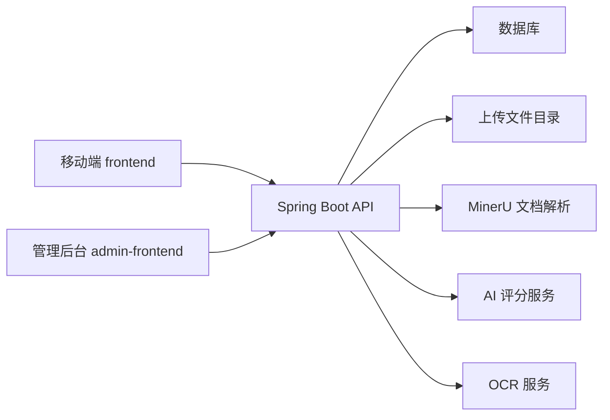
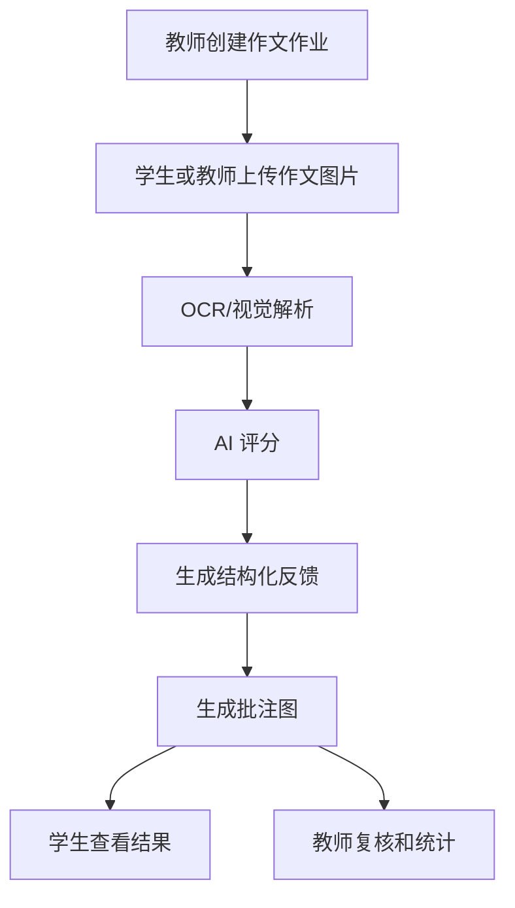
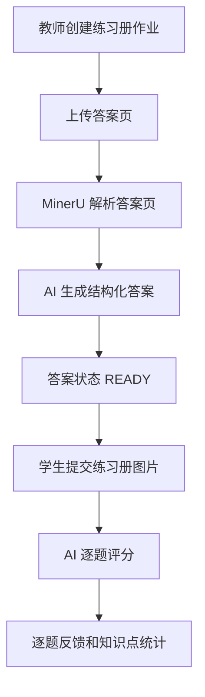

# 项目架构说明

## 一句话概括

PaperCritical 把“教师布置作业、学生提交图片、AI 批改、教师复核、班级统计”组织成完整闭环，而不是单纯调用一次大模型接口。

## 用户角色

| 角色 | 入口 | 能力 |
| --- | --- | --- |
| 教师 | 移动端、网页教师看板 | 注册/登录、创建作业、管理学生、上传答案页、查看批改结果、复核分数 |
| 学生 | 移动端学生入口 | 登录、查看班级作业、上传作业图片、查看批改进度和反馈 |
| 管理员 | Web 管理后台 | 查看全局数据、教师列表、批改记录、额度和卡密 |

## 系统分层

## 核心业务流程

### 作文批改

### 练习册批改

## 后端模块

| 模块 | 文件位置 | 说明 |
| --- | --- | --- |
| 认证 | `AuthController`, `AuthService` | 教师登录、教师注册、学生登录、微信登录、资料维护 |
| 作业 | `AssignmentController`, `AssignmentService` | 作业 CRUD、答案页上传、答案结构维护 |
| 学生 | `StudentController`, `StudentService` | 学生创建、批量导入、班级管理 |
| 批改 | `EssayController`, `EssayService` | 作文/练习册上传、进度、详情、复核、统计 |
| 学生门户 | `StudentPortalController` | 学生查看作业、提交作业、查看结果 |
| 管理后台 | `AdminController`, `AdminService` | 全局看板、教师、批改记录、卡密 |
| 额度 | `QuotaController`, `TeacherQuotaService` | 免费额度、付费额度、扣减和退回 |
| 支付模拟 | `PaymentController` | 创建订单、模拟支付 |
| 反馈 | `FeedbackController`, `StudentFeedbackController` | 教师/学生反馈收集 |

## 数据模型概览

| 表/实体 | 用途 |
| --- | --- |
| `tb_teacher` | 教师账号、姓名、学科、微信 openid |
| `tb_student` | 学生账号、班级、学号、所属教师 |
| `tb_assignment` | 作业信息、类型、题目、答案页状态和结构化答案 |
| `tb_essay` | 学生提交、图片、OCR/MinerU 结果、AI 分数、批注图、复核结果 |
| `tb_teacher_quota` | 教师免费和付费额度 |
| `tb_quota_usage_log` | 额度消耗和返还日志 |
| `tb_quota_card` | 管理后台生成的卡密 |
| `tb_user_feedback` | 用户反馈 |

## 状态说明

### 答案页状态

| 状态 | 含义 |
| --- | --- |
| `PENDING` | 练习册作业已创建，但还未上传答案页 |
| `PARSING` | 答案页正在解析 |
| `READY` | 答案页已解析，可用于练习册批改 |
| `FAILED` | 答案页解析失败，需要重新上传或人工检查 |

### 批改状态

| 状态 | 含义 |
| --- | --- |
| `UPLOADED` | 已上传，等待处理 |
| `OCR_PROCESSING` | OCR/文档解析中 |
| `AI_PROCESSING` | AI 批改中 |
| `GRADED` | AI 批改完成 |
| `TEACHER_REVIEWED` | 教师已复核 |
| `FAILED` | 批改失败 |

## 重要约束

- 学生账号不开放自助注册，由教师创建，确保学生归属于明确教师和班级。
- 练习册提交前，答案页必须是 `READY`，否则后端会返回 `Answer key is not ready yet`。
- 生产密钥、数据库密码、AI Key 不写入仓库文档。
- 移动端构建优先使用 HBuilderX，命令行构建需注意 Node 与 uni-cli 兼容性。
